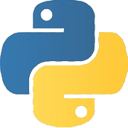
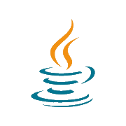
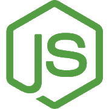
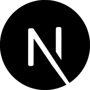

```
 ,ggg,        gg                 ,a8a,    d8'                     ,ggggggggggg,                      
dP""Y8b       88                ,8" "8,  d8'                     dP"""88""""""Y8,       ,dPYb, ,dPYb,
Yb, `88       88                d8   8b ""                       Yb,  88      `8b       IP'`Yb IP'`Yb
 `"  88       88   gg           88   88                           `"  88      ,8P  gg   I8  8I I8  8I
     88aaaaaaa88   ""           88   88                               88aaaad8P"   ""   I8  8' I8  8'
     88"""""""88   gg           Y8   8P     ,ggg,,ggg,,ggg,           88""""Y8ba   gg   I8 dP  I8 dP 
     88       88   88           `8, ,8'    ,8" "8P" "8P" "8,          88      `8b  88   I8dP   I8dP  
     88       88   88      8888  "8,8"     I8   8I   8I   8I          88      ,8P  88   I8P    I8P   
     88       Y8,_,88,_    `8b,  ,d8b,    ,dP   8I   8I   Yb,         88_____,d8'_,88,_,d8b,_ ,d8b,_ 
     88       `Y88P""Y8      "Y88P" "Y8   8P'   8I   8I   `Y8        88888888P"  8P""Y88P'"Y888P'"Y88

-. .. -.-. . / - --- / -- . . - / -- . -.-.--
```
> :world_map: I'm working with Terra GIS to create interactive web maps
> 
> :sunflower: I'm developing my backend skills using Express and MongoDB
> 
> :tongue: I’m interested in how technology can interact with language
> 
> :runner: Ask me about my goals as a hobby sprinter
> 
> :basketball: I enjoy reading, bouldering, basketball, and playing the piano + guitar
> 
> :envelope: You can reach me at: blloop@uw.edu
> 
> :cowboy_hat_face: Pronouns: he/him/his                                                                 

### Technology I Use :gear:
<table>
  <tr>
    <td><a href="#" style="pointer-events: none;">
      
    </a></td>
    <td><b>JavaScript</b><br>Language</td>
    <td><a href="#" style="pointer-events: none;">
      
    </a></td>
    <td><b>Python</b><br>Language</td>
    <td><a href="#" style="pointer-events: none;">
      
    </a></td>
    <td><b>Java</b><br>Language</td>
  </tr>
  <tr>
    <td><a href="#" style="pointer-events: none;">
      
    </a></td>
    <td><b>NodeJS</b><br>Framework</td>
    <td><a href="#" style="pointer-events: none;">
      
    </a></td>
    <td><b>NextJS</b><br>Framework</td>
    <td><a href="#" style="pointer-events: none;">
      
    </a></td>
    <td><b>MongoDB</b><br>Database</td>
  </tr>
</table>

### Highlights :octopus:
<a href="#" style="pointer-events: none;"></a>
