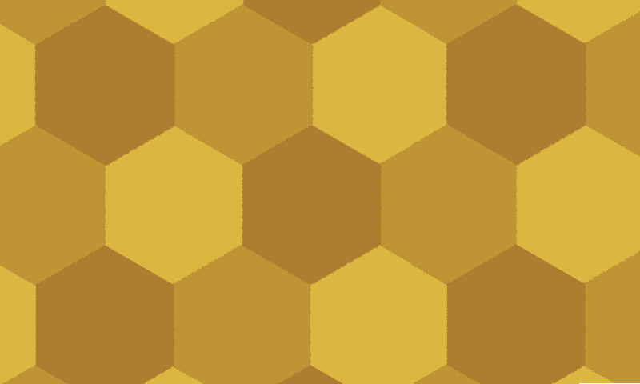

* :earth_americas: I'm working with TerraGIS, helping to create interactive GIS maps
* :seedling: I'm looking to revisit game dev this summer with small projects
* :thought_balloon: I’m interested in how technology can interact with language
* :running: Ask me about my goals as a hobby sprinter
* :musical_keyboard: I enjoy playing the piano, reading, bouldering, and hiking
* :mailbox: You can reach me at: blloop@uw.edu
* :smiley: Pronouns: he/him/his

### Cool Tools I Use :wrench:

### Favorite Languages

### Other Languages Learned

### Highlights :octopus:
