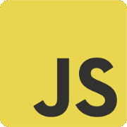

<h2> Hey, I'm Bill!</h2>

<em>Web Developer at TerraGIS CS / Linguistics Student at UW</em>

### My Current Stack:
<table>
  <tr>
    <td></td>
    <td><b>JavaScript</b> Language</td>
    <td></td>
    <td><b>Python</b> Language</td>
    <td></td>
    <td><b>TailwindCSS</b> Library</td>
  </tr>
  <tr>
    <td></td>
    <td><b>NextJS</b> Framework</td>
   <td></td>
    <td><b>NodeJS</b> Framework</td>
    <td></td>
    <td><b>MongoDB</b> Database</td>
  </tr>
</table>

### Highlights :octopus:

